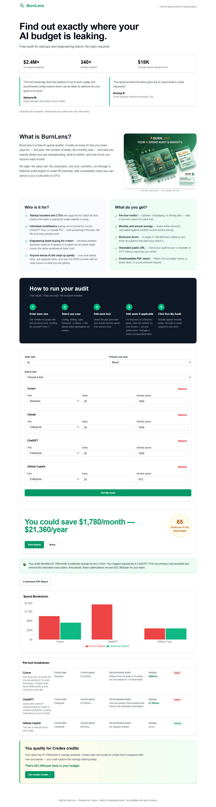
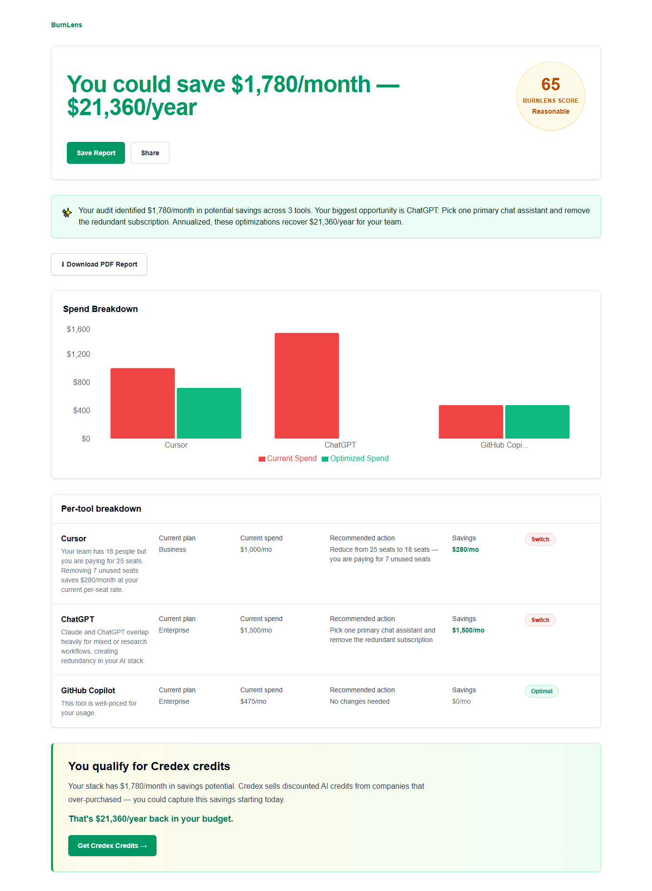
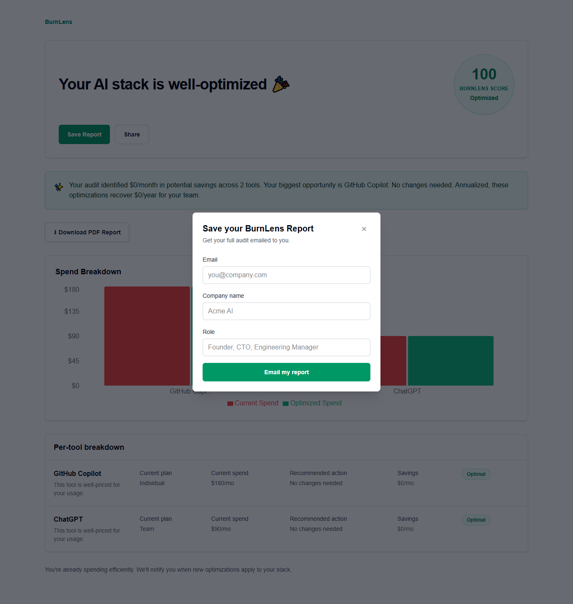

# BurnLens

**Free AI Spend Audit for startup founders and engineering managers.**

BurnLens helps you find out exactly where your AI budget is leaking.
Input what AI tools your team pays for, get an instant audit showing
where you're overspending, what to switch or downgrade, and your total
potential monthly and annual savings.

Built as a lead generation asset for [Credex](https://credex.rocks) —
a marketplace for discounted AI infrastructure credits.

---

## Live URL

[https://burnlens.vercel.app](https://burnlens.vercel.app)

---

## Screen Recording

[2-minute walkthrough of BurnLens — homepage to audit results to PDF export](https://www.loom.com/share/e7e75c827fa64ced9a7fc54715cb5a92)

---

## Screenshots

### Homepage


### Audit Results — live on screen


### Shareable Audit URL


### Save Report — email capture


---

## Quick Start

### Prerequisites
- Node.js 20+
- Git

### Install and run locally

```bash
git clone https://github.com/ShubhangiShruti/burnlens.git
cd burnlens
npm install
```

Create a `.env.local` file at the root:

NEXT_PUBLIC_SUPABASE_URL=your_supabase_url
NEXT_PUBLIC_SUPABASE_ANON_KEY=your_supabase_anon_key
ANTHROPIC_API_KEY=your_anthropic_key
RESEND_API_KEY=your_resend_key

Then run:

```bash
npm run dev
```

Open [http://localhost:3000](http://localhost:3000)

### Run tests

```bash
npm test
```

### Deploy

Push to main branch — Vercel auto-deploys on every push.

---

## Decisions

1. **Next.js App Router over Pages Router** — App Router enables React
   Server Components for the shareable audit page, meaning audit data
   is fetched server-side before rendering. Better for SEO and Open
   Graph previews which are critical for the viral sharing feature.

2. **Supabase over Firebase** — Supabase is Postgres under the hood,
   which means the audit and lead data is structured and queryable.
   Firebase's document model would make it harder to run analytics on
   savings amounts and conversion rates later.

3. **Hardcoded audit rules over AI-generated recommendations** — The
   assignment specifically called this out. Using AI for pricing logic
   would be non-deterministic and hard to verify. A finance person
   needs to agree with the reasoning. Pure TypeScript functions are
   testable, auditable, and fast.

4. **Best-effort Supabase writes** — The audit engine runs entirely in
   memory. Saving to the database is important for shareable URLs but
   should never block the user from seeing their results. If the DB
   write fails, the audit still completes successfully.

5. **Resend over SendGrid** — Resend has a simpler API, better React
   Email support for future HTML email templates, and a generous free
   tier. For a tool at this stage, developer experience matters more
   than enterprise features.